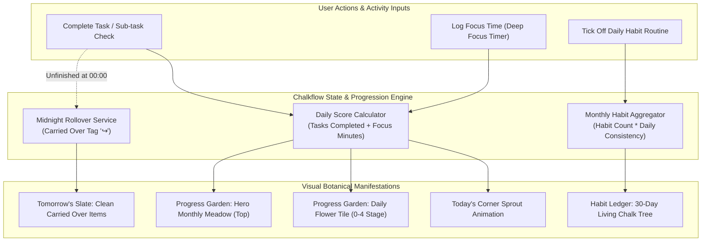

# Chalkflow — Information Architecture & Data Taxonomy Spec
**Phase 3: Navigation Schema, Data Models & Relational Engine**  
*Creative Director & Product Lead: Shouryaa (Fashion Communication, NIFT Hyderabad)*  
*Technical Project Architect & UX Mentor: Antigravity*

---

## 1. System Navigation Blueprint (Vertical Side Slate)

Chalkflow utilizes a **tactile vertical side navigation bar** anchored to the left of the blackboard surface. Each item pairs a textured hand-drawn chalk glyph with clear typography.

```
┌─────────────────┬────────────────────────────────────────────────────────┐
│  CHALKFLOW 🌿   │  [ ACTIVE SURFACE WORKSPACE ]                          │
│  ─────────────  │                                                        │
│  📝 Today's     │                                                        │
│     Slate       │                                                        │
│                 │                                                        │
│  📅 Upcoming    │                                                        │
│     Tasks       │                                                        │
│                 │                                                        │
│  🌸 Progress    │                                                        │
│     Garden      │                                                        │
│                 │                                                        │
│  🌳 Habit       │                                                        │
│     Ledger      │                                                        │
│                 │                                                        │
│  ⏱️ Deep        │                                                        │
│     Focus       │                                                        │
│  ─────────────  │                                                        │
│  🎨 Surface     │                                                        │
│     [Theme]     │                                                        │
└─────────────────┴────────────────────────────────────────────────────────┘
```

### Spatial Separation Rationale
- **Today's Slate vs. Upcoming:** Hard spatial segregation prevents future deadlines from polluting today's cognitive bandwidth.
- **Persistent Access:** Side navigation ensures 1-click movement across focus, garden reflection, and habit updates without nested menus.

---

## 2. Relational System Architecture & Data Flow



---

## 3. Comprehensive Data Taxonomy & Object Schema

### A. Task & Sub-task Entity (`TaskObject`)

| Attribute | Data Type | Options / Formats | UX Description |
| :--- | :--- | :--- | :--- |
| `id` | `UUID` | String | Unique task identifier. |
| `title` | `String` | e.g. "Draft Accessory Spec Sheet" | The core action string. |
| `priority` | `Enum` | `HIGH` (🔴), `MEDIUM` (🟡), `LOW` (🟢) | Hand-drawn chalk priority dot. |
| `category` | `Enum` | `ACADEMIC`, `WELLNESS`, `CREATIVE` | Classifies work for subtle color cues. |
| `subtasks` | `Array<SubTask>` | `[{ id, title, completed: Boolean }]` | Checkable micro-steps to lower initial friction. |
| `estimatedMinutes` | `Number` | 15, 30, 45, 60, 90+ | Approximate effort estimation. |
| `targetDate` | `Date` (ISO) | `YYYY-MM-DD` | Determines if rendered on *Today* or *Upcoming*. |
| `status` | `Enum` | `TODO`, `IN_PROGRESS`, `COMPLETED` | Task execution state. |
| `isCarriedOver` | `Boolean` | `true` / `false` | When true, renders muted `↪ Carried over` label. |

---

### B. Progress Garden Entity (`GardenDayPlot` & `MonthlyGarden`)

#### 1. Hero Main Garden (Top Section)
- **Concept:** A panoramic botanical meadow at the top of the screen that flourishes dynamically as the month unfolds. Every bloomed daily flower is added into this cohesive seasonal landscape.

#### 2. Daily Flower Tiles (Bottom Grid Section)
- **Layout:** 30/31-day visual calendar grid.
- **Attributes per Tile:**
  - `dayNumber`: 1 through 31.
  - `botanicalSpecimen`: e.g. "Sweet Violet" (Spring), "Chamomile" (Summer).
  - `tasksCompleted`: Number (e.g. 4).
  - `tasksPlanned`: Number (e.g. 5).
  - `focusMinutes`: Total focused minutes recorded.
  - `growthStage`: `STAGE_0_SEED`, `STAGE_1_SPROUT`, `STAGE_2_STEM`, `STAGE_3_BUD`, `STAGE_4_BLOOM`.
  - `restMessage`: Encouraging microcopy displayed on resting tiles.

```
┌────────────────────────────────────────────────────────────────────────┐
│  🌸 DAY 14 INSPECTION CARD (Chalk Slate Modal)                         │
├────────────────────────────────────────────────────────────────────────┤
│  Date: Tuesday, Oct 14 • Sweet Violet (Autumn Flora)                   │
│  Growth Stage: 🌸 Full Bloom                                           │
│  Tasks Completed: 5 of 5 planned                                       │
│  Deep Focus Logged: 1h 45m                                             │
│  Progress Score: 100%                                                  │
│                                                                        │
│  "A day of deep dedication. Your sweet violet stands in full bloom."  │
└────────────────────────────────────────────────────────────────────────┘
```

---

### C. Habit Ledger Entity (`HabitObject` & `MonthlyHabitTree`)

Rather than maintaining separate, competing trees, the Habit Ledger features **One Unified 30-Day Chalk Tree** per month.

- **Habit Object:**
  - `habitName`: e.g., "Hydrate (4L Water)", "Morning Sketching", "30m Reading".
  - `frequency`: Daily / Weekdays.
  - `completedDates`: Array of date strings.
  - `totalCompletionsThisMonth`: Aggregated tally.
- **Monthly Tree Growth Metric:**
  $$\text{Tree Growth Index} = \frac{\sum \text{Habit Completions Across All Habits}}{\text{Total Expected Completions in Month}} \times 100$$
  - **Days 1–5 (Seedling):** Taproots push beneath soil.
  - **Days 6–14 (Trunk):** Sturdy cross-hatched chalk bark thickens.
  - **Days 15–24 (Boughs):** Spreading branches and dense leaf clusters.
  - **Days 25–30 (Blossom & Fruit):** Crowning glowing blossoms; archived into Legacy Forest at month's end.
  - **Rest State:** Missing a day causes 2-3 chalk leaves to drift to the base with: *"Roots run deep; growth resumes whenever you are ready."*

---

### D. Focus Session Entity (`DeepFocusSession`)

- `durationMinutes`: User-adjustable (increment/decrement with `+` / `-` buttons, from 10m to 120m).
- `elapsedSeconds`: Real-time focus timer.
- `sessionState`: `IDLE`, `RUNNING`, `PAUSED`, `COMPLETED`.
- `soundscape`: `RAIN`, `CAMPFIRE`, `FOREST`, `LIBRARY`, `BROWN_NOISE`, `OFF`.
- `linkedTask`: Optional link to a specific task from Today's Slate.
- **Progression Credit:** Completed focus time automatically pushes the daily flower toward the next growth stage.
