# Chalkflow — Product Narrative & Strategic Objectives
**Phase 1: Foundation & Concept Brief**  
*Creative Director & Product Lead: Shouryaa (Fashion Communication, NIFT Hyderabad)*  
*Technical Project Architect & UX Mentor: Antigravity*

---

## 1. Executive Summary & Core Philosophy
**Chalkflow** is a calming, analog-inspired productivity and focus ecosystem designed for students, neurodiverse thinkers, and creatives who experience friction and anxiety with corporate, spreadsheet-like task managers.

Rooted in the philosophy of **"Slow Productivity"**, Chalkflow replaces guilt-inducing overdue streaks and cold data tables with the tactile serenity of an old-school classroom blackboard and the gentle reward of botanical growth. In Chalkflow, productivity is not an endless hamster wheel; it is a garden that honors daily effort, preserves a visible record of hard work, and offers a clean slate every morning without punishment.

```
       ┌────────────────────────────────────────────────────────┐
       │                 CHALKFLOW CORE ENGINE                  │
       │                                                        │
       │   [Tactile Blackboard]  +  [Botanical Growth Feedback] │
       │   - Clean slate reset      - Daily Flower Plot         │
       │   - Forgiving erasure      - 30-Day Progress Garden    │
       │   - Low sensory stress     - Habit Ledger (Tree)       │
       └────────────────────────────────────────────────────────┘
```

---

## 2. Core Metaphors & Aesthetic DNA

| Metaphor | Physical / Cultural Origin | Digital UX Translation in Chalkflow |
| :--- | :--- | :--- |
| **The Clean Slate** | Classroom slate / Blackboard | Tasks not finished quietly roll over at midnight; no red marks or negative metrics. Every morning is a fresh surface. |
| **The Growth Plot** | Botanical gardening & seasonal cycles | Daily effort germinates a seed into a bud and bloom. Completed work stays visible all month rather than vanishing into void. |
| **Rest over Failure** | Organic dormancy in nature | Missing a day leaves the plot "at rest" with reassuring microcopy (*"It's okay, try again tomorrow"*); plants never wither or die. |
| **Tactile Chalk** | Mineral chalk on slate stone | Textured typography, soft organic strokes, dusty erase transitions, and gentle chalk dust soundscapes. |

---

## 3. Visual Environment Modes (Board Surfaces)

1. **Dark Slate (Default Signature)**
   - *Base Tone:* Deep matte charcoal (`#181a1b`)
   - *Chalk Accents:* Coral, amber, mint, and soft white
   - *Atmosphere:* Night-time study, low-glare focus, intimate personal sanctuary.
2. **Vintage Classroom Green**
   - *Base Tone:* Deep heritage forest green (`#1e2d24`)
   - *Chalk Accents:* Warm ivory, pastel yellow, dusty sage
   - *Atmosphere:* Nostalgic academic space, tactile classroom memory.
3. **Parchment / Cream Paper**
   - *Base Tone:* Warm textured off-white / unbleached paper
   - *Chalk Accents:* Soft graphite, burnt umber, muted terracotta
   - *Atmosphere:* Sunlit daytime journaling, archival studio notebook.

---

## 4. Product Architecture (5 Core Views)

```mermaid
flowchart TD
    CF[Chalkflow Application] --> S1[1. Today's Slate]
    CF --> S2[2. Upcoming Tasks]
    CF --> S3[3. Progress Garden]
    CF --> S4[4. Habit Ledger]
    CF --> S5[5. Deep Focus Studio]

    S1 --> S1_1["Top Priority (Bright Red Chalk)"]
    S1 --> S1_2["Sub-task Breakdown System"]
    S1 --> S1_3["Subtle Corner Sprout Animation"]
    S1 --> S1_4["Midnight Gentle Rollover"]

    S2 --> S2_1["Future Planning (Cognitive Offload)"]
    S2 --> S2_2["Isolated from Today's Cognitive Load"]

    S3 --> S3_1["30-Day Monthly Garden Grid"]
    S3 --> S3_2["Day-by-Day Flower Bloom Archive"]
    S3 --> S3_3["Historical Inspector (Tasks & Study Time)"]

    S4 --> S4_1["Daily Habit Tracking"]
    S4 --> S4_2["21-30 Day Hand-drawn Chalk Tree"]

    S5 --> S5_1["Distraction-Free Round Chalk Clock"]
    S5 --> S5_2["Ambient Soundscapes (Rain, Campfire, Forest)"]
```



---

## 5. Friction vs. Chalkflow Solution Matrix

| # | Industry Friction (Todoist, Forest, Notion) | Chalkflow Emotional & IA Solution |
| :- | :--- | :--- |
| **1** | **The Void Effect:** Completed tasks vanish instantly into nothingness, leaving a continuous feeling of being behind. | **Botanical Permanence:** Every completed task feeds that day's flower. Work manifests into a monthly garden you can look back on with pride. |
| **2** | **Cognitive Overload:** 50 tasks visible at once triggering decision paralysis. | **Today's Slate vs. Upcoming:** Single-day focus with 1 primary task highlighted in red chalk at the top; future tasks quarantined in "Upcoming". |
| **3** | **Guilt & Punishment:** Streaks breaking, red overdue alerts, and dying trees (Forest) inducing anxiety. | **Forgiving Rest:** Plants never die; zero red overdue banners. Missed days display gentle rest notes (*"It's okay, try again tomorrow"*). |
| **4** | **Intimidating Ambiguity:** Monolithic tasks ("Complete Portfolio") cause procrastination. | **Chalk Step Breakdown:** Intuitive micro-steps under parent tasks to lower threshold of initial action. |
| **5** | **Cold Numbers & Metrics:** Abstract % completion bars and charts that feel like corporate KPIs. | **Organic Growth Feedback:** Tactile hand-drawn botanical milestones (Seed → Sprout → Bud → Bloom → Tree). |

---

## 6. Target Audience Persona Profiles
- **The Overwhelmed Design/Creative Student:** Juggling studio projects, research papers, and critiques; gets paralyzed by traditional Gantt charts and rigid task matrices.
- **The Self-Directed Independent Learner:** Needs a quiet, aesthetic environment for deep study blocks without algorithmic notifications or hustle-culture pressure.
- **The Neurodivergent / ADHD Planner:** Struggles with object permanence (if tasks disappear, effort feels erased) and rejection sensitivity (punitive red streaks cause app abandonment).
