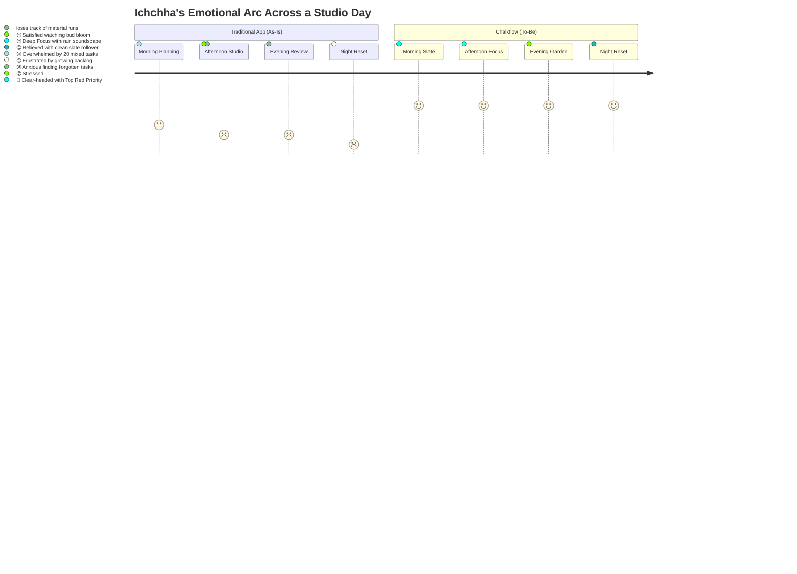

# Chalkflow — User Personas, Empathy Maps & Journey Architecture
**Phase 2: Empathy & User Experience Modeling**  
*Creative Director & Product Lead: Shouryaa (Fashion Communication, NIFT Hyderabad)*  
*Technical Project Architect & UX Mentor: Antigravity*

---

## 1. Persona Archetype A — The Studio / Design Student

### Profile & Context
```
       ┌────────────────────────────────────────────────────────────┐
       │  ICHCHHA  •  Age 20  •  Accessory Design Student (NIFT)   │
       ├────────────────────────────────────────────────────────────┤
       │  "I have so many things to finish,                         │
       │   I don't even know where to start."                       │
       └────────────────────────────────────────────────────────────┘
```
- **Context & Environment:** High-cognitive-load studio environment. Juggles physical prototyping, material sourcing (brass hardware, leather scraps, resin casting), digital CAD submissions, and jury critique deadlines.
- **Core Friction:** Multi-track task fragmentation. Big studio projects overshadow critical small tasks (e.g., buying A3 cartridge sheets or emailing a vendor), leading to anxiety and forgotten deliverables.
- **Cognitive Profile:** Visual thinker; gets overwhelmed by rigid spreadsheet lists; needs clear visual hierarchy and instant priority cues.

### Empathy Map (Says / Thinks / Does / Feels)

| Dimension | User Experience & Mental Model |
| :--- | :--- |
| **🗣️ SAYS** | *"I have so many things to finish, I don't even know where to start."* |
| **🧠 THINKS** | *"If I don't organise everything properly, I might forget something important for tomorrow's jury."* |
| **🏃 DOES** | Makes scattered task lists across paper slips and phone notes; shifts between tasks without finishing; pushes small errands aside for urgent studio work. |
| **💔 FEELS** | Overwhelmed by piling tasks; stressed when small details slip through the cracks; deeply satisfied when she can visually see tangible proof of completed work. |

### Chalkflow Solution Fit
- **Daily Slate Single-Screen Focus:** Isolates today's must-dos from the endless backlog.
- **Chalk Dot Priority System (🔴 🟡 🟢):** Instantly clarifies the single highest-impact task for studio hours.
- **Two-Step Strike & Felt Erase:** Gives physical, tactile closure to intense prototyping sessions.

---

## 2. Persona Archetype B — The Self-Learner / Exam Aspirant

### Profile & Context
```
       ┌────────────────────────────────────────────────────────────┐
       │  RIYA  •  Age 21  •  Self-Learner / Competitive Aspirant   │
       ├────────────────────────────────────────────────────────────┤
       │  "I didn't start my day properly,                         │
       │   I'll just start from tomorrow."                          │
       └────────────────────────────────────────────────────────────┘
```
- **Context & Environment:** Unstructured self-directed study blocks (CAT prep, design theory, portfolio research). Works in isolation with high personal expectations.
- **Core Friction:** The "All-or-Nothing" Cognitive Trap. Waking up late or missing an early morning study slot triggers feelings of complete daily failure, causing her to abandon the entire day.
- **Cognitive Profile:** Rejection sensitive; demotivated by broken streaks and aggressive red overdue tags; needs low friction to resume momentum.

### Empathy Map (Says / Thinks / Does / Feels)

| Dimension | User Experience & Mental Model |
| :--- | :--- |
| **🗣️ SAYS** | *"I didn't start my day properly, I'll just start from tomorrow."* |
| **🧠 THINKS** | *"If I couldn't follow my plan today, there's no point starting now. Today is already wasted."* |
| **🏃 DOES** | Over-schedules ideal days; experiences inertia after a late start; postpones entire blocks to tomorrow, snowballing unfinished tasks. |
| **💔 FEELS** | Demotivated by minor schedule slips; guilty about postponed work; anxious about starting over from scratch. |

### Chalkflow Solution Fit
- **Resting Seed State (🌱):** Reassures her that late or slow days are natural rest, not failure (*"Growth happens below the soil, too"*).
- **Carried Chalk (`↪`):** Eliminates shameful "Overdue" badges so she starts every afternoon or morning with a clean slate.
- **Brown Noise & Deep Focus:** Offers a low-barrier, single-click sensory container to break initiation paralysis.

---

## 3. As-Is vs. To-Be User Journey Maps

### A. Persona 1: Ichchha (The Design Student)



| Phase | As-Is (Without Chalkflow) | To-Be (With Chalkflow) | Chalkflow Emotional Value |
| :--- | :--- | :--- | :--- |
| **Morning** | 😐 Overwhelmed by endless studio and digital to-dos. | 🙂 Organizes Today's Slate; spots Top Priority in red chalk. | **Clarity:** Cognitive load is drastically narrowed. |
| **Afternoon** | 😵 Struggles to prioritise; forgets hardware store errands. | 😌 Enters Deep Focus studio; works through chalk micro-steps. | **Immersion:** Tactile focus without app distraction. |
| **Evening** | 😟 Anxious over missed items; lists feel chaotic. | 😊 Strikes through tasks; watches corner sprout grow. | **Proof of Work:** Effort is visibly validated. |
| **Night** | 😔 Frustrated; worries about tomorrow's mountain of tasks. | 😌 Carries unfinished items forward with `↪`; zero guilt. | **Sanctuary:** Sleep without backlog dread. |

---

### B. Persona 2: Riya (The Self-Learner)

```mermaid
journey
    title Riya's Emotional Arc Across an Unstructured Study Day
    section Traditional App (As-Is)
      Morning Routine: 4: 😊 Motivated with ambitious schedule
      Afternoon Delay: 2: 😕 Disappointed after late start
      Evening Abandon: 1: 😔 Demotivated, gives up on the day
      Night Guilt: 1: 😞 Guilty looking at red overdue badges
    section Chalkflow (To-Be)
      Morning Slate: 4: 😊 Ready to begin on a clean blackboard
      Afternoon Delay: 4: 😌 Breaks inertia with 1 micro-task
      Evening Study: 5: 🌿 Encouraged as sprout breaks soil
      Night Reset: 5: 🌸 Reassured; garden honors partial effort
```

| Phase | As-Is (Without Chalkflow) | To-Be (With Chalkflow) | Chalkflow Emotional Value |
| :--- | :--- | :--- | :--- |
| **Morning** | 😊 Sets rigid 8-hour schedule. | 😊 Opens clean Daily Slate with zero backlog clutter. | **Fresh Start:** No yesterday-guilt baggage. |
| **Afternoon** | 😕 Misses 9:00 AM slot; declares day ruined. | 😌 Starts late without penalty; breaks 1 task down. | **Low Inertia:** Easy re-entry anytime. |
| **Evening** | 😔 Abandons day; procrastinates on social media. | 🌿 Completes 2 tasks; sprout emerges on slate. | **Micro-Dopamine:** Every task leaves a botanical trace. |
| **Night** | 😞 Stares at red "OVERDUE" alerts; dreads tomorrow. | 🌸 Rests with a quiet bud (*"Growth happens below soil"*). | **Self-Compassion:** Rest is embraced, not penalized. |

---

## 4. Key Takeaways for Phase 3 (Information Architecture)
1. **Strict Spatial Separation:** Present actions (Today's Slate) and future planning (Upcoming) must live on separate tabs to protect Ichchha's working memory.
2. **Effort Continuity:** Riya requires the Progress Garden and Habit Tree to never show destructive states (no stumps, no red warnings).
3. **Frictionless Entry:** Deep Focus must require zero configuration—just pick a sound and press start.
