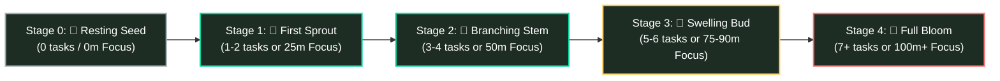

# 🌿 Chalkflow — Slow Productivity & Botanical Focus Sanctuary

> **An analog-inspired, non-punitive productivity ecosystem for students, designers, and overwhelmed minds.**  
> *Fashion Communication — NIFT Hyderabad (Information Architecture 2026)*  
> **Creative Director & Product Lead:** Shouryaa (BD-24-N4581)  
> **Technical Project Architect & UX Mentor:** Antigravity

---

## 📖 Table of Contents
1. [Core Philosophy & Cultural Context](#-core-philosophy--cultural-context)
2. [The 5 Blackboard Surfaces](#-the-5-blackboard-surfaces)
3. [Emotional Ergonomics & Forgiving Mechanics](#-emotional-ergonomics--forgiving-mechanics)
4. [Botanical Growth & Progression Engine](#-botanical-growth--progression-engine)
5. [Visual Design System & Board Themes](#-visual-design-system--board-themes)
6. [Acoustic Soundscapes (Web Audio API)](#-acoustic-soundscapes-web-audio-api)
7. [Project Documentation Roadmap](#-project-documentation-roadmap)
8. [Local Quickstart & Running the App](#-local-quickstart--running-the-app)

---

## 🌿 Core Philosophy & Cultural Context

Traditional productivity tools (Todoist, Notion, Forest) frequently induce **toxic productivity fatigue**—a continuous loop where tasks disappear into a void, overdue banners flash in shame-inducing red, and broken streaks punish natural human rest cycles.

**Chalkflow** is built on the foundation of **"Slow Productivity"**. It unites two restorative physical metaphors:
1. **The Classroom Blackboard:** A tactile, low-glare dark surface where ideas can be worked through, checked off with textured chalk strokes, and gently wiped clean with a felt eraser to start fresh every morning.
2. **The Botanical Nature Journal:** Daily academic and creative effort manifests into a permanent, living **Progress Garden** and a **30-Day Living Chalk Habit Tree**. Work is never erased into nothingness—it leaves a visible, beautiful trace.

```
       ┌────────────────────────────────────────────────────────┐
       │                 CHALKFLOW CORE ENGINE                  │
       │                                                        │
       │   [Tactile Blackboard]  +  [Botanical Growth Feedback] │
       │   - Clean slate reset      - Daily Flower Plot         │
       │   - Forgiving erasure      - 30-Day Progress Garden    │
       │   - Low sensory stress     - Habit Ledger (Tree)       │
       └────────────────────────────────────────────────────────┘
```

---

## 🖥️ The 5 Blackboard Surfaces

Chalkflow features a **persistent vertical side navigation bar** pairing hand-drawn chalk icons with clear typography:

1. **📝 Today's Slate:** The focused daily workbench. Displays only today's tasks with a prominent **Top Daily Priority** anchor (🔴 Coral Dot), checkable micro-step subtasks, and an **"Erase Completed"** felt wiper.
2. **📅 Upcoming Tasks:** A future planning shelf that isolates tomorrow's deadlines from today's cognitive bandwidth.
3. **🌸 Progress Garden:** A two-tier sanctuary featuring a **Panoramic Hero Botanical Meadow** at the top and a **31-Day Illustrated Nature Journal Grid** below with clickable day inspection cards.
4. **🌳 Habit Ledger:** A single **30-Day Living Chalk Tree** that dynamically develops taproots, textured bark, spreading boughs, and crowning blossoms as daily habits are maintained.
5. **⏱️ Deep Focus Studio:** An acoustic focus chamber with a round chalk clock, adjustable durations (`+5m`, `-5m`, `25m`, `45m`, `60m`), linked task anchoring, and real-time synthesized soundscapes.

---

## 🛡️ Emotional Ergonomics & Forgiving Mechanics

| Industry Anti-Pattern | Chalkflow Compassionate Alternative |
| :--- | :--- |
| ❌ Aggressive red `"OVERDUE"` banners | ✅ **`↪ Carried over`** in muted chalk styling |
| ❌ Punitive dead/withered trees (Forest) | ✅ **Resting Seed State (🌱)** (*"Growth happens below the soil, too"*) |
| ❌ Tasks instantly vanishing into a void | ✅ **Two-Step Completion:** Soft strike-through first, felt eraser swipe on demand |
| ❌ Fragile habit streak counters | ✅ **Non-Punitive Habit Tree:** Missed days drop gentle resting leaves; roots stay deep |

---

## 🌸 Botanical Growth & Progression Engine

Daily effort triggers organic growth thresholds on Today's Slate and the Progress Garden:



### Curated Seasonal Meadow (October Collection)
Every day reveals a unique illustrated botanical specimen: *Chrysanthemums, Golden Asters, Goldenrod, Dahlia Sprigs, Sweet Violets, Autumn Sage, and Marigolds*.

---

## 🎨 Visual Design System & Board Themes

Users can toggle between three calibrated board surfaces directly in the sidebar:
- **Dark Slate (Default):** Deep matte charcoal (`#181A1B`) with coral (`#FF6B6B`), amber (`#FFD166`), and mint (`#06D6A0`) chalk.
- **Vintage Classroom Green:** Heritage forest green (`#1B2A20`) with warm ivory (`#F4F1DE`) and dusty sage (`#81B29A`).
- **Parchment / Cream Paper:** Warm unbleached linen (`#F7F4EA`) with soft graphite (`#2B2D42`) and terracotta (`#E07A5F`).

**Typography Pairing:**
- **Display & Titles:** `Kalam` (Google Fonts — Tactile Handwriting)
- **UI & Numbers:** `Inter` (Google Fonts — Clean Sans-Serif)

---

## 🎧 Acoustic Soundscapes (Web Audio API)

Chalkflow synthesizes calming ambient audio natively in the browser without external media dependencies:
- 🌧️ **Steady Rain:** High-frequency filtered noise for heart rate relaxation.
- 🔥 **Warm Campfire:** Organic crackle impulses and low-pass thermal rumble.
- 🌲 **Forest Wind:** Swept resonant bandpass noise through tree canopies.
- 📚 **Quiet Library:** Low, insulating room hum for academic stillness.
- 🌊 **Brown Noise:** True $1/f^2$ Brownian waterfall rumble to quiet ADHD cognitive chatter.

---

## 📚 Project Documentation Roadmap

All phases of this Information Architecture project are documented in detail:
- [`instructions.md`](instructions.md) — Collaboration contract & 6-Phase Stage Gate Protocol.
- [`PHASE_1_NARRATIVE.md`](PHASE_1_NARRATIVE.md) — Problem statement, cultural context, and slow productivity philosophy.
- [`UX_RESEARCH.md`](UX_RESEARCH.md) — Competitor audit, emotional ergonomics, and 5-stage flora engine.
- [`PHASE_2_EMPATHY.md`](PHASE_2_EMPATHY.md) — Personas (Ichchha & Riya), empathy maps, and As-Is vs To-Be journey maps.
- [`IA_SPEC.md`](IA_SPEC.md) — 5-surface navigation schema, content inventory, and botanical data models.
- [`WIREFRAMES.md`](WIREFRAMES.md) — Screen-by-screen task flows and structural blackboard ASCII wireframes.
- [`DESIGN_SYSTEM.md`](DESIGN_SYSTEM.md) — Multi-surface color tokens, typography scales, and CSS texture rules.

---

## 🚀 Local Quickstart & Running the App

Simply open [`index.html`](index.html) in any modern web browser:

```bash
# Clone the repository
git clone https://github.com/NIFT-Information-Architecture-2026/Shouryaa_BD-24-N4581.git

# Open index.html directly in your default browser
start index.html
```
