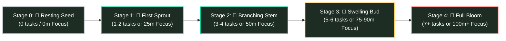

# Chalkflow — Comprehensive UX Research & Ergonomics Spec
**Phase 1: Precedents, Growth Engines, Tactile Ergonomics & Soundscapes**  
*Creative Director & Product Lead: Shouryaa (Fashion Communication, NIFT Hyderabad)*  
*Technical Project Architect & UX Mentor: Antigravity*

---

## 1. Executive Research Overview & Emotional Spectrum
Digital productivity tools frequently suffer from **toxic productivity anti-patterns**—visual and interactive mechanics that unintentionally trigger anxiety, guilt, and abandonment (rejection sensitivity). 

Chalkflow replaces punitive UI with **forgiving, slow-productivity ergonomics**, ensuring that the app remains a sanctuary for creative and academic focus rather than a digital surveillance dashboard.

```
       ┌──────────────────────────────────────────────────────────────┐
       │               EMOTIONAL ERGONOMICS SPECTRUM                  │
       │                                                              │
       │  PUNITIVE / CORPORATE                   FORGIVING / BOTANICAL │
       │  [Todoist / Forest / Notion]            [Chalkflow]          │
       │  ────────────────────────────           ───────────────────  │
       │  • Red "OVERDUE" alerts                 • Neutral "Carried over" ↪│
       │  • Dead, withered trees                 • Resting, dormant buds │
       │  • Endless disappearing lists           • 30-Day Bloom Garden │
       │  • Cold numerical percentages           • Organic flora stages │
       │  • Anxiety-inducing broken streaks      • Soil that always recovers │
       └──────────────────────────────────────────────────────────────┘
```

---

## 2. Method 1: Precedent & Anti-Pattern Audit

| Platform | Primary Core Pattern | Observed Anti-Pattern & Friction | Chalkflow Ergonomic Alternative |
| :--- | :--- | :--- | :--- |
| **Todoist** | Linear checklist with due dates and corporate priority flags (P1-P4). | **The Red Overdue Wall:** Unfinished tasks flash red with aggressive exclamation badges, inducing guilt upon opening. | **Carried Chalk (`↪`):** Unfinished items roll over quietly at midnight with soft neutral chalk tags and clean fresh start states. |
| **Forest** | Gamified Pomodoro timer planting virtual trees. | **Punitive Mortality:** Answering a call or exiting the app kills the tree, leaving an ugly withered stump on your grid. | **Dormant Rest State:** Unfinished days remain quiet seeds or buds with gentle reassurance (*"Growth happens below the soil, too"*). Plants never die. |
| **Momentum** | Browser replacement with serene backgrounds and focus mantras. | **Ephemeral Void:** Beautiful day-by-day focus, but lacks longitudinal permanence—no visual record of past weeks' effort. | **The 30-Day Monthly Garden:** Every single day's effort manifests into a permanent flower plot forming a vibrant monthly tapestry. |
| **Notion** | Modular relational databases, kanban boards, and document wikis. | **Cognitive Overload:** Infinite configuration options create "meta-procrastination" (spending more time designing systems than doing work). | **Constrained 5-Surface Architecture:** Rigid, calming chalk metaphor with zero database friction. |

---

## 3. Method 2: Botanical Growth & Progression Engine

### A. The 5-Stage Single Day Flora Thresholds



| Stage | Trigger Threshold | Visual Morphology on Slate | Emotional Meaning & Microcopy |
| :--- | :--- | :--- | :--- |
| **Stage 0: Resting Seed** | 0 tasks completed / 0m focus | A quiet, hand-drawn chalk seed resting in dark slate soil. | Zero guilt rest day. *"A quiet day of rest. Every seed needs time in the soil before it grows."* |
| **Stage 1: The First Sprout** | 1–2 tasks **OR** 25m Focus | Two delicate cotyledon leaves break through baseline. | Initial inertia broken; daily momentum ignited. |
| **Stage 2: Branching Stem** | 3–4 tasks **OR** 50m Focus | Textured vertical chalk stem branching with side leaves. | Consistent effort locked in across deep work blocks. |
| **Stage 3: Swelling Bud** | 5–6 tasks **OR** 75–90m Focus | Tightly closed floral crown bud glowing with chalk accent. | High-output momentum; one final push to bloom. |
| **Stage 4: Full Bloom** | 7+ tasks **OR** 100m+ Focus | Petals fully unfurled with glowing chalk highlights. | Maximum daily dedication; permanently woven into monthly garden. |

---

### B. The Botanical Meadow: Monthly Discovery Calendar
Instead of categorizing chores into rigid folders, each month functions as an **Illustrated Nature Journal** where every day unveils a unique seasonal botanical specimen. Hovering over any flower in the garden reveals its illustrated name and historic daily output.

```
       ┌─────────────────────────────────────────────────────────────┐
       │                 SEASONAL BOTANICAL COLLECTIONS              │
       ├─────────────────────────────────────────────────────────────┤
       │ 🌸 Spring (e.g. April)  : Cherry Blossoms, Daisies,         │
       │                          Sweet Violets, Anemones,           │
       │                          Forget-Me-Nots, Buttercups         │
       │ 🌻 Summer (e.g. July)   : Sunflowers, Wild Poppies,         │
       │                          Chamomile, Marigolds, Lavender     │
       │ 🍁 Autumn (e.g. October): Chrysanthemums, Asters,           │
       │                          Goldenrod, Dahlia sprigs           │
       │ ❄️ Winter (e.g. January): Winter Jasmine, Camellias,        │
       │                          Pine Sprigs, Snowdrops             │
       └─────────────────────────────────────────────────────────────┘
```

---

### C. The Habit Ledger: 30-Day Non-Punitive Chalk Tree
Unlike brittle habit streaks that collapse to zero upon a single missed day, the Habit Ledger cultivates a **Living 30-Day Chalk Tree Companion**.

```
    Days 1–5: 🌱 Taproot Seedling     → Breaks through ground; initial resistance overcome.
    Days 6–14: 🪵 Textured Trunk       → Cross-hatched chalk bark thickens; routine solidifies.
    Days 15–24: 🌿 Spreading Boughs    → Lateral boughs extend with dense leafy foliage.
    Days 25–30: 🌸 Crowning Blossom    → Blooms with luminous chalk fruit; stamped to Legacy Archive.
```

- **Non-Punitive Rest Behavior:** When a user misses a day, the tree does **not** chop down or wither. It stays serene at its current developmental stage, a few soft chalk leaves settle gently at the base, and an encouraging note appears:  
  > *"Roots run deep; growth resumes whenever you are ready."*

---

## 4. Method 3: Tactile Chalk Ergonomics & Soundscapes

### A. The Two-Step Completion Micro-Interaction
To preserve dopamine and prevent disorientation, task completion follows an intuitive two-step physical sequence:

1. **Step 1: Immediate Hand-Drawn Strike-Through**
   - **Action:** User clicks task checkbox.
   - **Visual Feedback:** A textured chalk line sweeps through the task text; a soft puff of chalk dust particles drifts downward; text opacity drops to 50%.
   - **Auditory Feedback:** Crisp, subtle chalk-scratch acoustic effect.
   - **Psychological Value:** Immediate proof-of-work validation (no sudden disappearance).

2. **Step 2: "Clear Slate" Felt Eraser Swipe**
   - **Action:** User taps *"Erase Completed"* at the bottom of the slate.
   - **Visual Feedback:** A horizontal felt-eraser bar sweeps across completed items, dissolving them into settling dust clouds. The corner sprout receives a gentle luminous growth pulse.
   - **Auditory Feedback:** Deep, textured felt-friction swipe sound.

---

### B. Deep Focus Soundscape Suite (5 Acoustic Environments)

| Soundscape | Acoustic Profile | Psychoacoustic & Focus Benefit |
| :--- | :--- | :--- |
| **🌧️ Steady Rain** | Gentle rhythmic raindrops against a glass pane. | Lowers heart rate, induces alpha brainwaves, and masks outside street noise. |
| **🔥 Warm Campfire** | Soft wood crackle with low-frequency thermal rumble. | Induces warmth and cozy late-night focus intimacy. |
| **🌲 Forest Wind** | Gentle breeze rustling through pine needles and canopy. | Expands mental bandwidth and creates an open, calm headspace. |
| **📚 Quiet Library** | Ultra-low ambient room hum with subtle, distant page turns. | Recreates the focused social presence of an empty historic study hall. |
| **🌊 Brown Noise** | Deep, warm, waterfall-like low-frequency roar. | Optimally dampens ADHD internal dialogue and eliminates abrupt domestic distractions. |

---

## 5. UI Priority & Carried Over Conventions

```
┌────────────────────────────────────────────────────────────────────────┐
│  DAILY SLATE                                        Tuesday, Oct 06    │
├────────────────────────────────────────────────────────────────────────┤
│                                                                        │
│  [ ]  🔴 ↪ Complete CAT Quantitative Mock #4                           │
│          Carried over • High Priority                                  │
│                                                                        │
│  [ ]  🟡 Review Fashion History Slides (Ch. 4)                         │
│          Medium Priority                                               │
│                                                                        │
│  [ ]  🟢 Buy A3 cartridge paper & 2B graphite pencils                  │
│          Low Priority                                                  │
│                                                                        │
└────────────────────────────────────────────────────────────────────────┘
```
- 🔴 **Coral Red Chalk Dot (`#FF6B6B`):** High Priority anchor.
- 🟡 **Warm Amber Chalk Dot (`#FFD166`):** Medium Priority.
- 🟢 **Mint Chalk Dot (`#06D6A0`):** Low Priority / Errands.
- ↪ **Muted Neutral Chalk Arrow (`#A0AAB2`):** Carried over indicator (*"From yesterday"*).
