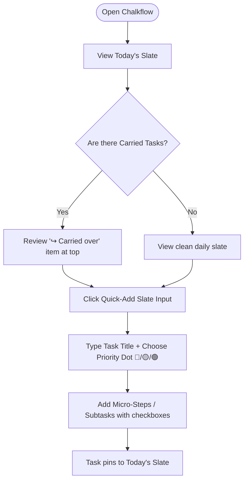
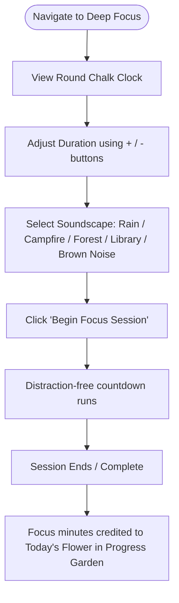
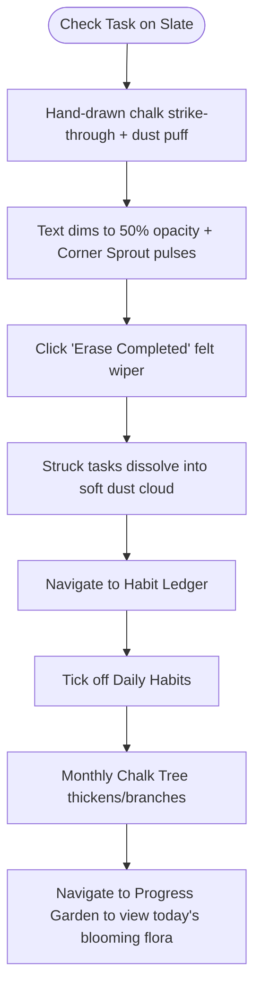

# Chalkflow — User Task Flows & Low-Fidelity Wireframes
**Phase 4: Interaction Flows, Screen Blueprints & Structural Layouts**  
*Creative Director & Product Lead: Shouryaa (Fashion Communication, NIFT Hyderabad)*  
*Technical Project Architect & UX Mentor: Antigravity*

---

## 1. Global Layout Frame & Side Navigation

All five views share a unified **tactile chalkboard container** with a persistent vertical left navigation bar.

```
┌──────────────────────────────────────────────────────────────────────────────────────────────────┐
│  CHALKFLOW 🌿                                                       Board: [ Dark Slate ▾ ]      │
├───────────────────┬──────────────────────────────────────────────────────────────────────────────┤
│                   │                                                                              │
│  📝 Today's Slate │   [ ACTIVE SCREEN CONTENT AREA ]                                             │
│                   │                                                                              │
│  📅 Upcoming Tasks│                                                                              │
│                   │                                                                              │
│  🌸 Progress      │                                                                              │
│     Garden        │                                                                              │
│                   │                                                                              │
│  🌳 Habit Ledger  │                                                                              │
│                   │                                                                              │
│  ⏱️ Deep Focus    │                                                                              │
│                   │                                                                              │
│  ─────────────────│                                                                              │
│  🌱 Oct Garden:   │                                                                              │
│     14/31 Blooms  │                                                                              │
└───────────────────┴──────────────────────────────────────────────────────────────────────────────┘
```

---

## 2. Method 1: Core User Task Flows

### Flow A: Morning Task Triage & Sub-task Breakdown


---

### Flow B: Deep Focus Session & Ambient Immersion


---

### Flow C: Task Completion, Two-Step Erase & Evening Habit Check


---

## 3. Method 2: Structural Low-Fidelity Blackboard Wireframes

### Wireframe 1: Today's Slate (Active Daily Workspace)
```
┌───────────────────┬──────────────────────────────────────────────────────────────────────────────┐
│  CHALKFLOW 🌿     │  TODAY'S SLATE                            Tuesday, October 08                │
├───────────────────┼──────────────────────────────────────────────────────────────────────────────┤
│  [📝 Today's Slate│  ┌─ Quick-Add Chalk Line ──────────────────────────────────────────────┐     │
│   📅 Upcoming     │  │  ✍️ + Write a new task for today...        [🔴 High ▾] [Add Task]    │     │
│   🌸 Garden       │  └─────────────────────────────────────────────────────────────────────┘     │
│   🌳 Habit Ledger │                                                                              │
│   ⏱️ Deep Focus   │  📌 TOP PRIORITY                                                             │
│                   │  ┌────────────────────────────────────────────────────────────────────────┐  │
│                   │  │ [ ]  🔴 ↪ Complete CAT Quantitative Mock #4                            │  │
│                   │  │      Carried over • High Priority • Est: 60m                           │  │
│                   │  │      ┌──────────────────────────────────────────────────────────────┐  │  │
│                   │  │      │  [x] Section 1: Arithmetic (20 Qs)                           │  │  │
│                   │  │      │  [ ] Section 2: Algebra & Geometry (15 Qs)                   │  │  │
│                   │  │      └──────────────────────────────────────────────────────────────┘  │  │
│                   │  └────────────────────────────────────────────────────────────────────────┘  │
│                   │                                                                              │
│                   │  📝 OTHER TASKS FOR TODAY                                                    │
│                   │  ┌────────────────────────────────────────────────────────────────────────┐  │
│                   │  │ [ ]  🟡 Source brass hardware for bag prototype                        │  │
│                   │  │      Medium Priority • Creative • Est: 30m                             │  │
│                   │  ├────────────────────────────────────────────────────────────────────────┤  │
│                   │  │ [x]  🟢 <s>Buy A3 cartridge paper & 2B pencils</s>                     │  │
│                   │  │      Low Priority • Completed                                          │  │
│                   │  └────────────────────────────────────────────────────────────────────────┘  │
│                   │                                                                              │
│                   │  [ 🧹 Erase Completed Tasks ]                  🌱 Today's Sprout: Stage 2    │
└───────────────────┴──────────────────────────────────────────────────────────────────────────────┘
```

---

### Wireframe 2: Upcoming Tasks (Future Offload Shelf)
```
┌───────────────────┬──────────────────────────────────────────────────────────────────────────────┐
│  CHALKFLOW 🌿     │  UPCOMING TASKS                           Future Planning Shelf              │
├───────────────────┼──────────────────────────────────────────────────────────────────────────────┤
│   📝 Today's Slate│  ┌─ Quick-Add for Future Dates ────────────────────────────────────────┐     │
│  [📅 Upcoming]    │  │  ✍️ + Plan a future task...      [📅 Pick Date ▾] [🟡 Med ▾] [Save]   │     │
│   🌸 Garden       │  └─────────────────────────────────────────────────────────────────────┘     │
│   🌳 Habit Ledger │                                                                              │
│   ⏱️ Deep Focus   │  🗓️ TOMORROW (Oct 09)                                                       │
│                   │  ┌────────────────────────────────────────────────────────────────────────┐  │
│                   │  │ [ ]  🔴 Accessory Design Jury Presentation Slides                      │  │
│                   │  │ [ ]  🟡 Read Chapter 5: 20th Century Textile Movements                 │  │
│                   │  └────────────────────────────────────────────────────────────────────────┘  │
│                   │                                                                              │
│                   │  🗓️ LATER THIS WEEK                                                         │
│                   │  ┌────────────────────────────────────────────────────────────────────────┐  │
│                   │  │ [ ]  🟢 Studio cleanup & scrap leather sorting                         │  │
│                   │  │ [ ]  🟡 Submit Information Architecture Case Study                     │  │
│                   │  └────────────────────────────────────────────────────────────────────────┘  │
└───────────────────┴──────────────────────────────────────────────────────────────────────────────┘
```

---

### Wireframe 3: Progress Garden (Two-Tiered Botanical Gallery)
```
┌───────────────────┬──────────────────────────────────────────────────────────────────────────────┐
│  CHALKFLOW 🌿     │  PROGRESS GARDEN                          October 2026 • Autumn Meadow       │
├───────────────────┼──────────────────────────────────────────────────────────────────────────────┤
│   📝 Today's Slate│  ┌─ HERO BOTANICAL MEADOW (Top Panoramic Landscape) ──────────────────────┐  │
│   📅 Upcoming     │  │                                                                        │  │
│  [🌸 Garden]      │  │        🌸 (D1)      🌷 (D2)     🌱 (D3-Rest)    🌸 (D4)     🌸 (D5)    │  │
│   🌳 Habit Ledger │  │      Chrysanthemum    Aster       Dormant Seed     Goldenrod   Dahlia  │  │
│   ⏱️ Deep Focus   │  │   ~~~~~~~~~~~~~~~~~~~~~~~~~~~~~~~~~~~~~~~~~~~~~~~~~~~~~~~~~~~~~~~~~    │  │
│                   │  └────────────────────────────────────────────────────────────────────────┘  │
│                   │                                                                              │
│                   │  📅 DAILY BOTANICAL CALENDAR GRID (Click tile to inspect)                    │
│                   │  ┌───────┬───────┬───────┬───────┬───────┬───────┬───────┐                  │
│                   │  │ 01 🌸 │ 02 🌷 │ 03 🌱 │ 04 🌸 │ 05 🌸 │ 06 🌿 │ 07 🌸 │                  │
│                   │  │ Bloom │ Bud   │ Rest  │ Bloom │ Bloom │ Stem  │ Bloom │                  │
│                   │  ├───────┼───────┼───────┼───────┼───────┼───────┼───────┤                  │
│                   │  │ 08 🌿 │ 09 🌸 │ 10 🌸 │ 11 🌱 │ 12 🌷 │ 13 🌸 │ 14 🌸 │                  │
│                   │  │ Today │ —     │ —     │ —     │ —     │ —     │ —     │                  │
│                   │  └───────┴───────┴───────┴───────┴───────┴───────┴───────┘                  │
└───────────────────┴──────────────────────────────────────────────────────────────────────────────┘
```

---

### Wireframe 4: Habit Ledger (Single 30-Day Chalk Tree)
```
┌───────────────────┬──────────────────────────────────────────────────────────────────────────────┐
│  CHALKFLOW 🌿     │  HABIT LEDGER                             October Habit Tree (Day 8/31)      │
├───────────────────┼──────────────────────────────────────────────────────────────────────────────┤
│   📝 Today's Slate│  ┌─ 30-DAY CHALK HABIT TREE ─┐  ┌─ DAILY HABIT CHECKLIST ────────────────┐  │
│   📅 Upcoming     │  │            🌿🌿           │  │                                        │  │
│   🌸 Garden       │  │          🌿🌿🌿🌿         │  │  [x]  💧 Drink 4 Liters Water          │  │
│  [🌳 Habit Ledger]│  │         🌿🌿🌿🌿🌿        │  │       Completed 7/8 days this month    │  │
│   ⏱️ Deep Focus   │  │            |||            │  │                                        │  │
│                   │  │            |||            │  │  [x]  📖 30 Mins Design Reading        │  │
│                   │  │           / | \           │  │       Completed 6/8 days this month    │  │
│                   │  │       ~~~~~~~~~~~~~       │  │                                        │  │
│                   │  │   "Stage 2: Sturdy Trunk" │  │  [ ]  🧘 Morning Sketchbook Drill      │  │
│                   │  │   Roots run deep.         │  │       Completed 5/8 days this month    │  │
│                   │  └───────────────────────────┘  └────────────────────────────────────────┘  │
└───────────────────┴──────────────────────────────────────────────────────────────────────────────┘
```

---

### Wireframe 5: Deep Focus Studio (Acoustic Chamber)
```
┌───────────────────┬──────────────────────────────────────────────────────────────────────────────┐
│  CHALKFLOW 🌿     │  DEEP FOCUS STUDIO                        Distraction-Free Sanctuary         │
├───────────────────┼──────────────────────────────────────────────────────────────────────────────┤
│   📝 Today's Slate│                                                                              │
│   📅 Upcoming     │                                  ╭──────────╮                                │
│   🌸 Garden       │                               ╭──╯  45:00   ╰──╮                             │
│   🌳 Habit Ledger │                               │   MINUTES    │                             │
│  [⏱️ Deep Focus]  │                               ╰──╮  REMAIN  ╭──╯                             │
│                   │                                  ╰──────────╯                                │
│                   │                       [ - 5m ]   [ ▶ START ]   [ + 5m ]                      │
│                   │                                                                              │
│                   │  🎧 SELECT AMBIENT FOCUS SOUNDSCAPE                                          │
│                   │  ┌───────────┐ ┌───────────┐ ┌───────────┐ ┌───────────┐ ┌───────────┐       │
│                   │  │ 🌧️ Rain   │ │ 🔥 Fire   │ │ 🌲 Wind   │ │ 📚 Library│ │ 🌊 Brown  │       │
│                   │  │ [Active]  │ │ [Select]  │ │ [Select]  │ │ [Select]  │ │ [Select]  │       │
│                   │  └───────────┘ └───────────┘ └───────────┘ └───────────┘ └───────────┘       │
│                   │                                                                              │
│                   │  🔗 Linked Task: "Complete CAT Quantitative Mock #4"                         │
└───────────────────┴──────────────────────────────────────────────────────────────────────────────┘
```
